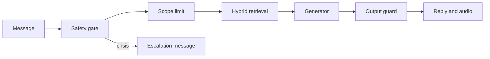
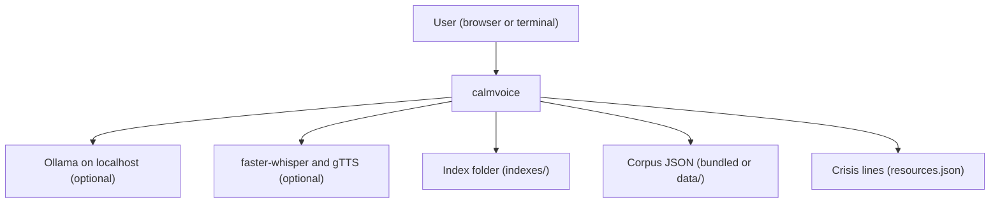
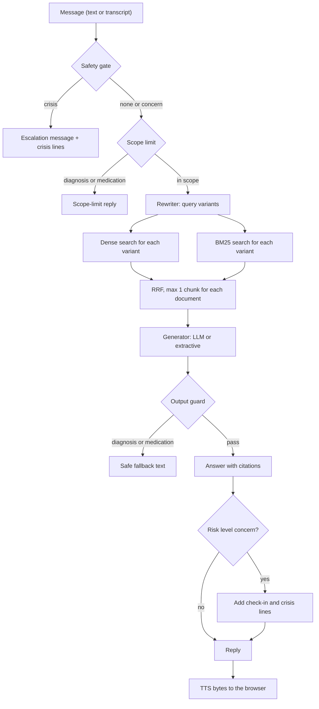

<div align="center">

# calmvoice — Safety-First Voice Wellbeing Companion with Local RAG

**calmvoice is a wellbeing support companion for people who want general coping information by text or voice. It takes a message through these steps to a cited, checked reply:**

`assess risk` → `check scope` → `retrieve (hybrid + RRF)` → `generate with citations` → `guard output` → `speak in the browser`.


**[Summary](#1-summary)** ·
**[Workflow](#4-the-end-to-end-workflow)** ·
**[Run it](#10-how-to-run-calmvoice)** ·
**[Configuration](#104-environment-variables)** ·
**[Known problems](#13-known-problems)** ·
**[Glossary](#15-glossary)**

</div>

> [!NOTE]
> This README uses ASD-STE100 Simplified Technical English. The writing rules and the project
> vocabulary are in [`docs/ste-style-guide.md`](docs/ste-style-guide.md). Each term in the
> [Glossary](#15-glossary) has only one meaning.

---

> [!WARNING]
> Do not use calmvoice as a medical device, a therapy service or an emergency service.
> It gives general wellbeing information only. It does not diagnose and it does not advise on medication.
> A clinical and ethics review is necessary before any use with real people.
> The keyword rules miss some crisis messages. A human must stay responsible for each person in a deployment.

calmvoice answers a message about stress, worry, sleep or low mood with short, cited information from a curated, licensed corpus.
The main idea is safety first. A safety gate assesses every message before retrieval, and a crisis message never reaches the LLM.
The companion then retrieves chunks with real multi-query hybrid search and generates a reply with citations.
An output guard blocks diagnoses and medication advice. Voice works with audio bytes from the browser, so it also works on a remote server.

This README is the **one location that explains all of calmvoice**. It gives these topics:

- the general design
- each component and its procedure, step by step
- the decision rules
- the data map
- the runbook
- the validation results and the known problems

| If you are… | Read |
|---|---|
| A manager or reviewer | [1](#1-summary), [3](#3-design-rules), [4](#4-the-end-to-end-workflow), [12](#12-validation-results), [14](#14-key-points) |
| A developer who joins the project | All sections, in sequence. Keep [10](#10-how-to-run-calmvoice) and [13](#13-known-problems) open while you work |
| An operator who runs calmvoice | [10](#10-how-to-run-calmvoice), then the section for the component that you use |

---

## Table of contents

1. 🧭 [Summary](#1-summary)
2. 🏗️ [How calmvoice is built](#2-how-calmvoice-is-built)
   - 2.1 [Components](#21-components)
   - 2.2 [System context](#22-system-context)
   - 2.3 [Repository layout](#23-repository-layout)
3. 🛡️ [Design rules](#3-design-rules)
4. 🔄 [The end-to-end workflow](#4-the-end-to-end-workflow)
   - 4.1 [Full flow](#41-full-flow)
   - 4.2 [The life cycle of one message](#42-the-life-cycle-of-one-message)
5. 🔵 [The safety gate](#5-the-safety-gate)
6. 🟢 [The corpus, the chunks and the index](#6-the-corpus-the-chunks-and-the-index)
7. 🟣 [Retrieval, generation and voice](#7-retrieval-generation-and-voice)
   - 7.1 [Hybrid retrieval](#71-hybrid-retrieval)
   - 7.2 [Generation and the output guard](#72-generation-and-the-output-guard)
   - 7.3 [Voice and session memory](#73-voice-and-session-memory)
8. ⚖️ [The decision rules](#8-the-decision-rules)
9. 🗂️ [Data and file map](#9-data-and-file-map)
10. ▶️ [How to run calmvoice](#10-how-to-run-calmvoice)
    - 10.1 [Prerequisites](#101-prerequisites) · 10.2 [Installation](#102-installation) · 10.3 [Run calmvoice](#103-run-calmvoice) · 10.4 [Environment variables](#104-environment-variables)
11. 🧩 [How to extend calmvoice](#11-how-to-extend-calmvoice)
12. ✅ [Validation results](#12-validation-results)
13. ⚠️ [Known problems](#13-known-problems)
14. 📌 [Key points](#14-key-points)
15. 📖 [Glossary](#15-glossary)
16. 📄 [License](#16-license)

---

## 1. Summary

**The problem.** A person in distress writes or speaks a message, and a support tool must answer safely and with correct information. These questions are difficult:

- How do you find a crisis message before any LLM text goes to the user?
- Which knowledge is safe to show, and which texts have a licence for reuse?
- How do you retrieve the right information when people use everyday words?
- How do you stop an LLM that diagnoses or gives medication advice?
- How do you add voice when the server has no microphone and no speaker?
- How do you measure safety and retrieval, and not only text length?

calmvoice gives each of these questions its own component. Each component has a typed input, a typed output and unit tests.

| Item | Value |
|---|---|
| Input | A text message, or audio bytes from the browser microphone |
| Output | A `Reply`: text, route, risk level, numbered sources with licences, guard reasons |
| Components | **18** modules plus the Streamlit page: config, corpus, chunking, textutil, embeddings, index, lexical, retrieval, safety, safety_model, llm, generation, memory, companion, voice, evaluation, synthetic, cli |
| Providers | Ollama (local LLM), sentence-transformers MiniLM, faster-whisper, gTTS, FAISS. All are optional |
| Offline mode | Hashing embedder, BM25, rule rewriter, extractive generator and tone TTS. No key and no network |
| Safety | The safety gate runs first. A crisis message gets the escalation message and never reaches the LLM |
| Tests | **81** unit tests (`pytest`). In CI, 80 pass and 1 skips (FAISS is not in the `dev` extra) |



---

## 2. How calmvoice is built

### 2.1 Components

| Component | Module | Purpose |
|---|---|---|
| Settings | `src/calmvoice/config.py` | Environment variables with validation and a local `.env` loader |
| Corpus | `src/calmvoice/corpus.py` | Pydantic schema, licence allow-list, fingerprint |
| Chunker | `src/calmvoice/chunking.py` | Exact slices of whole sentences, with overlap |
| Text helpers | `src/calmvoice/textutil.py` | Tokens and a light stemmer for matching only |
| Embedders | `src/calmvoice/embeddings.py` | `HashingEmbedder` (offline) and `MiniLMEmbedder` (optional) |
| Index | `src/calmvoice/index.py` | Persisted `DenseIndex`, NumPy or FAISS backend, rebuild on change |
| BM25 | `src/calmvoice/lexical.py` | Okapi BM25 over the chunks |
| Retriever | `src/calmvoice/retrieval.py` | Rewriters, RRF, dense, lexical and hybrid modes |
| Safety layer | `src/calmvoice/safety.py` | Rules, safety gate, scope limits, output guard, crisis lines |
| Classifier | `src/calmvoice/safety_model.py` | Optional TF-IDF and logistic regression, GroupKFold evaluation |
| LLM adapters | `src/calmvoice/llm.py` | `OllamaLLM` (standard library HTTP) and `ScriptedLLM` for tests |
| Generators | `src/calmvoice/generation.py` | System policy, `LLMGenerator`, `ExtractiveGenerator` |
| Session memory | `src/calmvoice/memory.py` | Opt-in, bounded history in memory only |
| Companion | `src/calmvoice/companion.py` | The pipeline and `build_companion` |
| Voice | `src/calmvoice/voice.py` | Bytes-in, bytes-out STT and TTS adapters |
| Evaluation | `src/calmvoice/evaluation.py` | Safety recall, retrieval recall@k and MRR, answer grounding |
| Synthetic data | `src/calmvoice/synthetic.py` | Seeded red-team set with template ids |
| CLI | `src/calmvoice/cli.py` | The `calmvoice` command with 9 subcommands |
| Streamlit page | `src/calmvoice/app/streamlit_app.py` | Browser microphone, audio playback, session state |
| Package data | `src/calmvoice/data/` | `corpus.json`, `resources.json`, `retrieval_eval.jsonl` |

### 2.2 System context



### 2.3 Repository layout

```
calmvoice/
├── .github/workflows/ci.yml     # CI: Python 3.11, pip install -e ".[dev]", pytest -q
├── data/README.md               # corpus schema, licence rules, sources (data files are git-ignored)
├── docs/ste-style-guide.md      # writing rules and project vocabulary
├── src/calmvoice/
│   ├── app/streamlit_app.py     # optional browser page
│   ├── data/                    # demo corpus, crisis lines, retrieval queries
│   ├── safety.py                # safety gate, scope limits, output guard
│   ├── retrieval.py             # rewriters, RRF, hybrid retriever
│   ├── companion.py             # the pipeline
│   └── ...                      # the other modules in 2.1
├── tests/                       # 81 unit tests, no network
├── .env.example                 # variable names only
└── pyproject.toml               # core deps: numpy, pydantic. Extras: embeddings, faiss, voice, ui, ml, dev
```

---

## 3. Design rules

### 3.1 Safety before generation
The companion calls `SafetyGate.assess` before it retrieves or generates. A `crisis` message gets the escalation message with region-specific crisis lines. The LLM does not see it. A test checks that `ScriptedLLM.calls` stays empty for a crisis message.

### 3.2 Recall before precision in the rules
The rules in `safety.py` look for many phrasings of suicide, self-harm, harm to others and abuse. A false alarm costs less than a missed crisis. The optional classifier can only raise the risk level. It can never lower the level that the rules give.

### 3.3 Only licensed, curated knowledge
The corpus schema accepts only three content types: `psychoeducation`, `self-help-exercise` and `service-information`. It accepts only licences that allow reuse. Personal forum posts and copyrighted books fail validation. The reply shows the title, source and licence of each document.

### 3.4 Unmodified text for embedding and display
The chunker cuts each document into whole sentences. It does not change the case, it does not remove stopwords and it does not lemmatise. Each chunk is an exact slice of the document, and a test checks this.

### 3.5 Real fusion or no fusion
RRF over one ranked list gives the same order as that list. In hybrid mode, the retriever searches each query variant with the dense index and with BM25. Thus RRF always fuses several lists.

### 3.6 Voice on the client side
The server never opens a microphone or a speaker. `voice.py` receives audio bytes and returns audio bytes. The Streamlit page records with `st.audio_input` and plays with `st.audio`.

### 3.7 Memory only when the user asks
`SessionMemory` is off by default. When the user turns it on, it keeps the last 6 turns in memory for the browser session. calmvoice writes no conversation to disk.

---

## 4. The end-to-end workflow

### 4.1 Full flow



### 4.2 The life cycle of one message

1. The browser sends text, or audio bytes that the STT adapter transcribes.
2. The safety gate assesses the message and gives a risk level.
3. If the risk level is `crisis`, the companion returns the escalation message and stops.
4. The scope limit checks for diagnosis and medication questions.
5. If the message is out of scope, the companion returns a scope-limit reply and stops.
6. The rewriter makes up to 3 query variants.
7. The retriever searches each variant two times, fuses the lists with RRF and keeps the top 4 chunks.
8. The generator writes a reply with citations `[n]`.
9. The output guard blocks diagnoses and medication advice and removes invalid citations.
10. If the risk level is `concern`, the companion adds a check-in and the crisis lines.
11. If session memory is on, the companion stores the turn in memory.
12. The TTS adapter changes the reply text into audio bytes for the browser.

---

## 5. The safety gate

**Purpose.** Find a message that needs human help before any generated text goes to the user.

| Input | Output |
|---|---|
| A message | `RiskAssessment`: `level`, `categories`, `matches`, `source` |

**Procedure**

1. Normalise the message: change curly apostrophes to straight ones and collapse spaces.
2. Search the message with each of the 27 rules (17 crisis rules, 10 concern rules).
3. Give the message the highest level of all matched rules.
4. If a classifier is attached, get its level.
5. Keep the higher of the two levels.

**Rules**

- The crisis categories are `suicide`, `self_harm`, `harm_to_others` and `abuse`.
- The concern categories are `hopelessness` and `medical`.
- Idioms such as `this deadline is killing me` or `I could die of embarrassment` do not match. Tests check 6 idioms.
- The escalation message has three forms: for harm to others, for abuse and for all other crisis categories.
- `resources.json` has crisis lines for `US`, `CA`, `GB` (also `UK`), `IE`, `AU`, `IN` and a `DEFAULT` directory.

| Region | Emergency | Crisis line |
|---|---|---|
| `US` | 911 | 988 Suicide & Crisis Lifeline, call or text 988 |
| `CA` | 911 | 9-8-8 Suicide Crisis Helpline, call or text 988 |
| `GB` | 999 | Samaritans, 116 123 |
| `IE` | 112 or 999 | Samaritans Ireland, 116 123 |
| `AU` | 000 | Lifeline Australia, 13 11 14 |
| `IN` | 112 | Tele-MANAS, 14416 |
| `DEFAULT` | local emergency number | Find A Helpline directory |

The crisis lines were correct in October 2026. Check each number with the official service before a deployment.

**The optional classifier.** `LearnedRiskClassifier` uses word and character TF-IDF with a balanced logistic regression. `group_cross_validate` evaluates it with GroupKFold on the template id. Thus no paraphrase of a test template is in the training folds. The companion does not attach the classifier by default (see [12](#12-validation-results)).

---

## 6. The corpus, the chunks and the index

**Purpose.** Keep a small, licensed corpus and a persisted index that the companion loads on each start.

| Input | Output |
|---|---|
| Corpus JSON (bundled or `CALMVOICE_CORPUS`) | `DenseIndex` in `CALMVOICE_INDEX_DIR`: `vectors.npy`, `chunks.json`, `index_meta.json` |

**Procedure**

1. Load the corpus JSON and validate it with the `Corpus` schema.
2. Calculate the corpus fingerprint (the first 16 hex digits of a SHA-256 hash).
3. If the index folder has the same fingerprint, embedder name and chunk settings, load the index.
4. If not, cut each document into chunks of whole sentences (max 420 characters, 1 sentence of overlap).
5. Embed the title and the text of each chunk.
6. Save the vectors, the chunks and the metadata.

**Rules**

- The schema forbids extra fields, so a hard-coded label such as `target: 0` fails validation.
- Each chunk keeps the `topic` of its own document.
- A sentence longer than the limit becomes one chunk. The chunker does not cut a sentence.
- `HashingEmbedder` uses `crc32` feature hashing of stemmed words, word bigrams and character trigrams (1024 dimensions). The vectors are the same in each process.
- `MiniLMEmbedder` uses `sentence-transformers/all-MiniLM-L6-v2` (extra `embeddings`).
- The default backend is NumPy. The `faiss` backend uses `IndexFlatIP` (extra `faiss`).

The bundled corpus has 14 documents and gives 28 chunks with the default settings.

| Topic | Documents |
|---|---|
| `stress` | `slow-breathing`, `stress-workload` |
| `anxiety` | `grounding-senses`, `panic-body`, `worry-time` |
| `sleep` | `sleep-habits`, `racing-thoughts-night` |
| `low-mood` | `behavioural-activation`, `unhelpful-thoughts` |
| `coping` | `self-compassion`, `physical-activity` |
| `relationships` | `social-connection` |
| `help-seeking` | `when-to-get-help`, `talking-therapies` |

---

## 7. Retrieval, generation and voice

### 7.1 Hybrid retrieval

**Purpose.** Get the chunks that answer a message, also when the message uses everyday words.

| Input | Output |
|---|---|
| A message, `k` | A list of `Retrieved` (chunk, RRF score, query variants) |

**Procedure**

1. Make the query variants with the rewriter.
2. Embed the variants and search the dense index for each variant (depth 20).
3. Search BM25 for each variant (depth 20, `k1` 1.5, `b` 0.75).
4. Fuse all lists with RRF, score = sum of 1 / (60 + rank).
5. Keep max 1 chunk for each document until there are `k` chunks.

**Rules**

| Rewriter | Variants | Use |
|---|---|---|
| `RuleRewriter` | The message, its content words, and the content words plus vocabulary expansions (38 entries) | Default in hybrid mode, offline |
| `LLMRewriter` | The message plus up to 3 LLM paraphrases | Optional. On an LLM error it returns the message only |
| `SingleQuery` | The message | Dense and lexical modes, and the ablation in [12](#12-validation-results) |

### 7.2 Generation and the output guard

**Purpose.** Write a short reply from the sources only, with a citation for each fact.

| Input | Output |
|---|---|
| Message, retrieved chunks, history | Checked reply text and the guard result |

**Procedure**

1. `LLMGenerator` sends the system policy, the numbered sources and the message to the LLM.
2. `ExtractiveGenerator` (offline) writes an opening for the topic, the 3 best matching source sentences with citations and a closing referral.
3. If the LLM fails with `LLMError`, the companion uses the extractive generator.
4. The output guard checks the text for diagnosis claims and medication advice.
5. If the guard finds one, it replaces the text with a safe fallback and the route is `blocked`.
6. The guard removes each citation `[n]` that points to no source.

**Rules**

- The system policy tells the LLM to be brief (max 150 words), to cite, to never diagnose and to never name medication.
- The default LLM temperature is 0.2.
- `OllamaLLM` calls `POST /api/chat` on `CALMVOICE_OLLAMA_URL` with the standard library. User text does not go to a third-party API.

### 7.3 Voice and session memory

**Purpose.** Let the user speak and listen in the browser, and keep context only when the user asks.

| Adapter | Class | Package |
|---|---|---|
| Speech-to-text | `WhisperSTT` | `faster-whisper` (extra `voice`) |
| Speech-to-text (tests) | `ScriptedSTT` | none |
| Text-to-speech | `GTTSTextToSpeech` (MP3 bytes) | `gTTS` (extra `voice`, needs network) |
| Text-to-speech (offline) | `ToneTTS` (WAV bytes) | none |

**Procedure**

1. The Streamlit page records audio in the browser with `st.audio_input`.
2. `voice_turn` transcribes the bytes, gets the reply and synthesizes audio bytes.
3. The page plays the bytes in the browser with `st.audio`.

**Rules**

- `voice.py` imports no audio device library. A test checks that `pyaudio`, `pygame`, `playsound`, `speech_recognition` and `sounddevice` are not loaded.
- The page keeps one companion and one `SessionMemory` in `st.session_state`. A rerun does not clear the history and does not embed the corpus again.
- `SessionMemory` keeps max 6 turns. The sidebar has a toggle and a clear button.

---

## 8. The decision rules

**Risk levels**

| Level | Meaning | Companion action |
|---|---|---|
| `none` | No rule matched | Normal answer |
| `concern` | A concern rule matched (hopelessness, medical) | Answer, plus a check-in sentence and the crisis lines |
| `crisis` | A crisis rule matched, or the classifier gave `crisis` | Escalation message only. No retrieval, no LLM |

**Routes**

| Route | When | Sources in the reply |
|---|---|---|
| `crisis` | Risk level `crisis` | None |
| `out_of_scope` | The message asks about medication or diagnosis | None |
| `answer` | The output guard passed the text | Yes, with licences |
| `blocked` | The output guard found a diagnosis or medication advice | None |
| `empty` | The message is empty | None |

**Thresholds and limits**

| Setting | Value | Where |
|---|---|---|
| Chunk size | max 420 characters, 1 sentence of overlap | `chunking.py` |
| Search depth for each list | 20 | `Retriever.depth` |
| RRF constant | 60 | `Retriever.rrf_k` |
| Chunks for each document | max 1 | `Retriever.max_per_doc` |
| Top chunks | 4 (`CALMVOICE_TOP_K`) | `Companion.top_k` |
| Classifier crisis threshold | probability ≥ 0.35 | `LearnedRiskClassifier` |
| Grounding threshold (evaluation) | ≥ 60 % of the claim words are in the cited source | `evaluation.grounded` |
| Memory | max 6 turns, off by default | `SessionMemory` |

---

## 9. Data and file map

| Path | Committed? | Contents |
|---|---|---|
| `src/calmvoice/data/corpus.json` | Yes | 14 author-written CC0 documents |
| `src/calmvoice/data/resources.json` | Yes | Crisis lines for each region |
| `src/calmvoice/data/retrieval_eval.jsonl` | Yes | 28 queries with relevant document ids |
| `data/README.md` | Yes | Corpus schema, licence rules, sources |
| `data/*` (other files) | No (git ignores it) | Your corpus, red-team files |
| `indexes/` | No (git ignores it) | Persisted indexes |
| `models/`, `outputs/` | No (git ignores it) | Local artefacts |
| `*.wav`, `*.mp3`, `*.webm` | No (git ignores it) | Audio |
| `.env` | No (git ignores it) | Local settings |

---

## 10. How to run calmvoice

### 10.1 Prerequisites

| Need | For |
|---|---|
| Python 3.11+ | All components |
| Ollama with `llama3.2` | Optional local LLM (`CALMVOICE_LLM=ollama`) |
| Extra `embeddings` | MiniLM dense embeddings |
| Extra `voice` | Whisper STT and gTTS |
| Extra `ui` | Streamlit page |
| Extra `faiss` | FAISS backend |
| Extra `ml` | Learned classifier |

### 10.2 Installation

```bash
git clone https://github.com/KrishnaAnnavaram/calmvoice.git
cd calmvoice
python -m venv .venv
. .venv/bin/activate            # Windows: .venv\Scripts\activate
pip install -e ".[dev]"
```

### 10.3 Run calmvoice

```bash
# Offline demo: no key, no network
calmvoice build-index                       # builds indexes/default once
calmvoice ask "I lie awake at night and my mind races"
calmvoice ask "I want to die" --region GB   # escalation message, no LLM call
calmvoice chat --memory                     # interactive text chat
calmvoice resources --region IN

# Evaluation
calmvoice eval-safety --with-classifier     # needs scikit-learn (dev or ml extra)
calmvoice eval-retrieval --k 4
calmvoice eval-answers
calmvoice redteam --out data/redteam.jsonl
calmvoice validate-corpus data/my_corpus.json

# Local LLM with Ollama
ollama pull llama3.2
CALMVOICE_LLM=ollama calmvoice ask "how can I calm down before an exam"

# Browser page with voice
pip install -e ".[ui,voice]"
streamlit run src/calmvoice/app/streamlit_app.py
```

### 10.4 Environment variables

| Variable | Used by | Meaning |
|---|---|---|
| `CALMVOICE_LLM` | `build_companion` | `offline` (default) or `ollama` |
| `CALMVOICE_OLLAMA_URL` | `OllamaLLM` | Ollama server, default `http://localhost:11434` |
| `CALMVOICE_OLLAMA_MODEL` | `OllamaLLM` | Model name, default `llama3.2` |
| `CALMVOICE_TEMPERATURE` | `OllamaLLM` | 0 to 1, default 0.2 |
| `CALMVOICE_EMBEDDER` | index, retriever | `hashing` (default) or `minilm` |
| `CALMVOICE_CORPUS` | corpus loader | Path to a corpus JSON. Empty means the bundled corpus |
| `CALMVOICE_INDEX_DIR` | index | Index folder, default `indexes/default` |
| `CALMVOICE_TOP_K` | companion | Number of chunks, default 4 |
| `CALMVOICE_REGION` | crisis lines | Region code, default `US` |
| `CALMVOICE_MEMORY` | session memory | `1` turns memory on for the CLI. Default off |

calmvoice needs no API key. Local settings are only in a `.env` file. Git ignores this file. Do not commit it.

---

## 11. How to extend calmvoice

| You want to… | Do this | Code change? |
|---|---|---|
| Use your own licensed corpus | Write the JSON (see `data/README.md`), run `validate-corpus`, set `CALMVOICE_CORPUS` | No |
| Add a region | Add an entry to `resources.json` | No (data only) |
| Add a crisis phrasing | Add a `_r(...)` rule to `CRISIS_RULES` and a test case | Small |
| Attach the classifier | Fit `LearnedRiskClassifier` on labelled data and pass it to `SafetyGate(classifier=...)` | Small |
| Use a different LLM server | Write a class with `complete(system, prompt, history)` | Small |
| Use another STT or TTS engine | Write a class with `transcribe(Audio)` or `synthesize(text)` | Small |
| Add a vocabulary expansion | Add an entry to `EXPANSIONS` in `retrieval.py` | Small |

---

## 12. Validation results

All numbers come from the commands in the table, on the bundled corpus and the synthetic red-team set. They are synthetic results. They are not results on real users.

| Validation | Result | Command |
|---|---|---|
| Unit tests | **81 passed** (local). Expected CI: 80 passed, 1 skipped (FAISS) | `pytest -q` |
| Red-team set | 145 synthetic messages: 73 `crisis`, 24 `concern`, 48 `none` | `calmvoice eval-safety` |
| Crisis recall, rules | **0.877** (64 of 73), 95 % Wilson CI 0.782 to 0.934 | `calmvoice eval-safety` |
| Crisis precision, rules | 1.000 | `calmvoice eval-safety` |
| False alarms on harmless messages | 0 of 48 | `calmvoice eval-safety` |
| Classifier, GroupKFold by template | crisis recall 0.740, crisis precision 0.535, macro F1 0.332 | `calmvoice eval-safety --with-classifier` |
| Retrieval, dense | recall@4 0.869, hit@4 0.929, MRR 0.696 | `calmvoice eval-retrieval` |
| Retrieval, BM25 | recall@4 0.792, hit@4 0.857, MRR 0.685 | `calmvoice eval-retrieval` |
| Retrieval, hybrid single-query | recall@4 0.869, hit@4 0.929, MRR 0.708 | `calmvoice eval-retrieval` |
| Retrieval, hybrid multi-query | **recall@4 0.905, hit@4 0.964 (CI 0.82 to 0.99), MRR 0.768** | `calmvoice eval-retrieval` |
| Answers, offline generator | 28 of 28 answered, citation validity 1.000, grounded claims 1.000, mean 86.9 words | `calmvoice eval-answers` |

The rules miss 9 crisis messages. All 9 come from the 3 hard templates that have no crisis keyword, for example `I just want everything to stop forever`. This result shows the main limit of keyword rules.

The classifier does not generalise to templates that it did not see. Thus the companion does not attach it by default. A real classifier needs real, labelled data and a clinical review.

Multi-query hybrid retrieval gives the best recall and MRR on the 28 queries. The query set and the vocabulary expansions have the same author, so the result is optimistic.

The grounding score of the offline generator is 1.000 by design, because it copies source sentences. The metric is useful for an LLM generator.

The prototype reported no safety or retrieval numbers. Its ANOVA and t-tests compared the length of retrieved documents, so there is no prototype result to compare.

---

## 13. Known problems

Read these problems before you use calmvoice in production.

| # | Area | Problem | Impact and action |
|---|---|---|---|
| 1 | Safety | The rules miss crisis messages without a keyword (recall 0.877 on synthetic data) | Do not use calmvoice without a human in the loop. Collect reviewed real phrasings and add rules |
| 2 | Safety | The red-team set is synthetic and has the same author as the rules | The recall is optimistic. Get an independent red-team set reviewed by clinicians |
| 3 | Safety | The rules are English only | Messages in other languages pass as `none`. Add rules or a multilingual classifier |
| 4 | Classifier | The classifier does not generalise across templates (macro F1 0.332) | It is off by default. Train it only on real, labelled and reviewed data |
| 5 | Corpus | The bundled corpus is short, author-written and not reviewed by a clinician | Replace it with licensed psychoeducation material from a health authority |
| 6 | Retrieval | The hashing embedder has no semantic knowledge of synonyms | Use `CALMVOICE_EMBEDDER=minilm` for real use |
| 7 | Evaluation | There is no human rubric for empathy and no RAGAS faithfulness score | Add a clinician-rated rubric before a pilot |
| 8 | LLM | The output guard uses patterns, so an LLM can phrase a diagnosis in a way that passes | Review LLM replies. Keep the temperature low |
| 9 | Crisis lines | Numbers change | Check `resources.json` before each deployment |
| 10 | Voice | gTTS sends the reply text to an external service | Use a local TTS engine for private deployments |
| 11 | Bias | Rules and corpus reflect one author and English-language norms | Test with diverse users and a review board |

**Responsible use.** calmvoice is not a medical or diagnostic tool. Human review is necessary for every deployment. The safety data and the corpus can have cultural and language bias.

---

## 14. Key points

1. **Safety comes first.** The safety gate runs before retrieval, and a crisis message never reaches the LLM.
2. **The knowledge is licensed and curated.** The schema rejects personal posts and text without a reuse licence.
3. **Fusion is real.** Each query variant gives a dense list and a BM25 list, and RRF fuses all of them.
4. **Voice uses bytes, not devices.** The browser records and plays. The server only changes bytes.
5. **Everything runs offline.** The demo and the 81 tests need no key and no network.
6. **The numbers are honest.** The README gives the misses of the rules and the weak classifier result.

---

## 15. Glossary

| Term | Meaning |
|---|---|
| **Companion** | The `Companion` pipeline that answers one message |
| **Message** | The text that the user types or says in one turn |
| **Reply** | The `Reply` object that the companion returns |
| **Route** | The path of a message: `crisis`, `out_of_scope`, `answer`, `blocked`, `empty` |
| **Risk level** | `none`, `concern` or `crisis` |
| **Safety gate** | The rules plus the optional classifier |
| **Escalation message** | The fixed reply for a crisis message, with crisis lines |
| **Crisis line** | A telephone or text support service in `resources.json` |
| **Scope limit** | The check that refuses diagnosis and medication questions |
| **Output guard** | The check on generated text before the user sees it |
| **Corpus** | The validated JSON file of curated, licensed documents |
| **Chunk** | An exact slice of one document, made of whole sentences |
| **Index** | The persisted chunk vectors plus metadata |
| **Fingerprint** | The hash of the corpus content that the index stores |
| **Query variant** | One text that the rewriter makes from a message |
| **RRF** | Reciprocal rank fusion: score = sum of 1 / (60 + rank) over the ranked lists |
| **Citation** | A marker `[n]` that points to source n of the reply |
| **Red-team set** | Synthetic messages with a known risk level |
| **Template** | One pattern of the red-team set, with a `template_id` |
| **Recall@k** | The share of relevant documents in the top k results |
| **MRR** | Mean reciprocal rank of the first relevant document |

---

## 16. License

[MIT](LICENSE) © 2026 Krishna Annavaram
